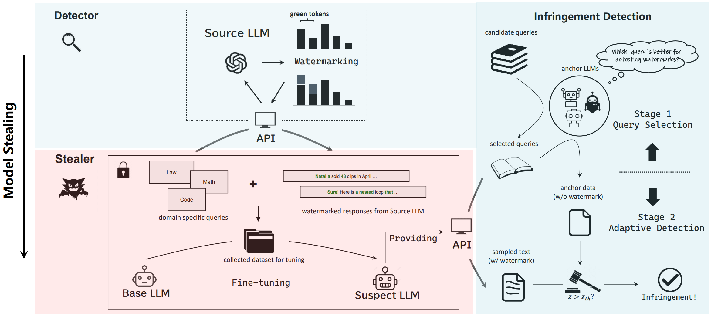

#  Can Watermarks Be Used to Detect LLM IP Infringement for Free?


## Quick Start
```
git clone https://github.com/ZhengyueZhao/llm_infringement_detection.git
cd llm_infringement_detection
pip install -r requirements.txt
```
### Preparation
First, prepare the suspect model set for infringement detection.

Step 1. Sample distillation data from the source models.
```
./script/generate_distill_data.sh
```

Step 2. Fine-tune the suspect model with the sampled distillation data.

```
./script/train.sh
```

### Run Detection
Then detect infringing models from the suspect model set.

Step 1. Generate anchor data with anchor models.
```
./script/generate_anchor_data.sh
```

Step2. Select candidate quries from the query set.
```
./script/select_query.sh
```

Step 3. Sample text from suspect models for detection.
```
./script/generate_detect_data.sh
```

Step 4. Run the detection process.
```
./script/detect.sh
```
